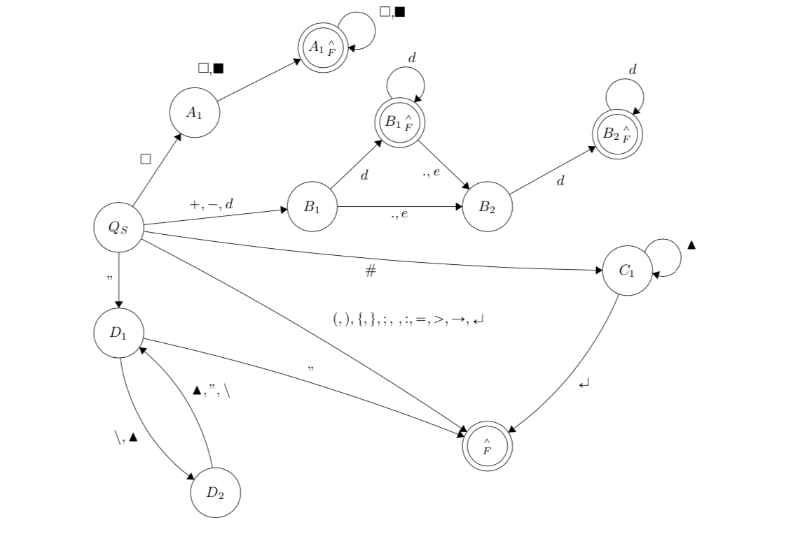

# hasky (/ˈhuːsky/)
[](https://travis-ci.org/L3rchal/hasky)  

## functional language made with python3

* _lazy, slow, stupid, adorable_ programming language
* inspired by Haskell and other functional langauges 🧐
* this is a prototype concept 
* gain experience about creating laguages and how compiler or interpreters work
* interpreted language

## Info

Grammar and lexical analysis made to crate interpreted language similar to other functional lanaguages like haskell. 

Language output suppose to be latex form. This form can be used however user wants -- hasky is just tool to generate such forms/layouts. Goal is to create .tex files faster.

Goal was to make hasky grammar as easy as possible and at the same time to create useful language.

### Finite state machine for lexical analysis


### Language grammar


## Demo

```
.__                   __           
|  |__ _____    _____|  | _____.__.
|  |  \__   \  /  ___/  |/ <   |  | | hasky alpha v. 0.0.4
|   Y  \/ __ \_\___ \|    < \___  | | demo version
|___|  (____  /____  >__|_ \/ ____| | 
     \/     \/     \/     \/\/     

every line must end with comma ';'
hasky> print = fn x: x;
hasky> print "hello world";
"hello world"
```
